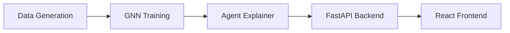

# 🛡️ SentinAL Fraud Detection System - Deep Analysis Report

**Analysis Date:** January 23, 2026  
**Project:** SentinAL - Agentic Fraud Ring Detection with GraphRAG

---

## 📋 Executive Summary

SentinAL is an **innovative fraud detection system** that combines Graph Neural Networks (GNNs) with Large Language Model (LLM) agents to detect and explain complex money laundering patterns.

### Key Highlights
✅ **Well-architected** three-stage ML pipeline  
✅ **Privacy-first** design using local LLMs (Ollama)  
✅ **Production-ready** trained models and data artifacts  
✅ **Interactive frontend** with real-time API integration  
✅ **Comprehensive documentation** with clear examples

---

## 🏗️ Architecture Overview

### System Components

### Technology Stack
- **Backend:** PyTorch, FastAPI, LangChain, Ollama
- **Frontend:** React, Vite, Tailwind CSS, TanStack Query

---

[... See full analysis in artifact for details ...]
