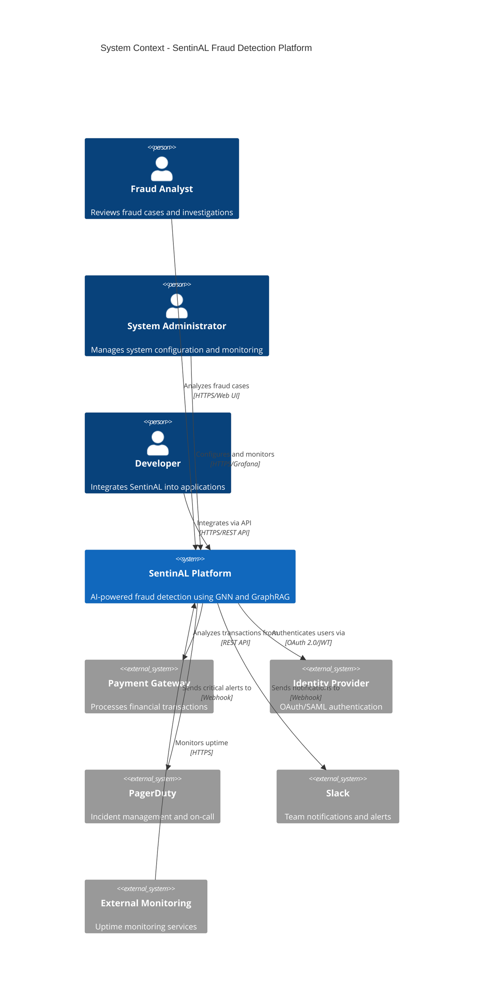
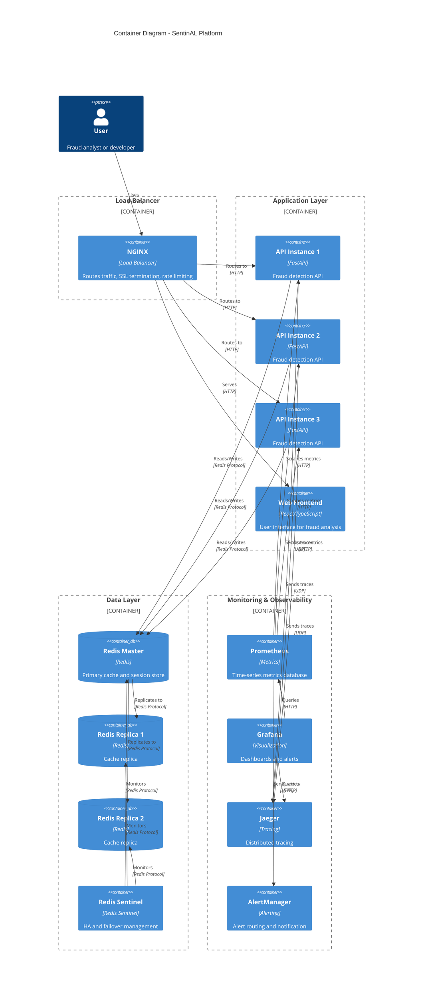
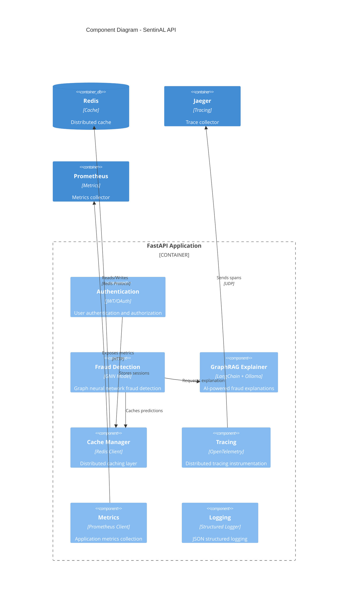
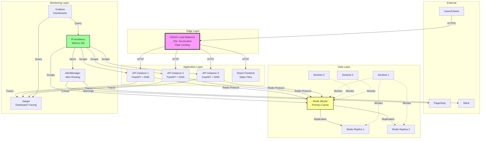
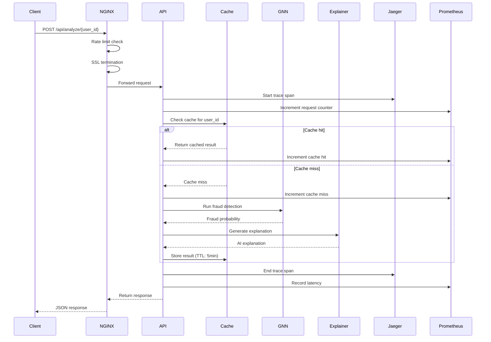
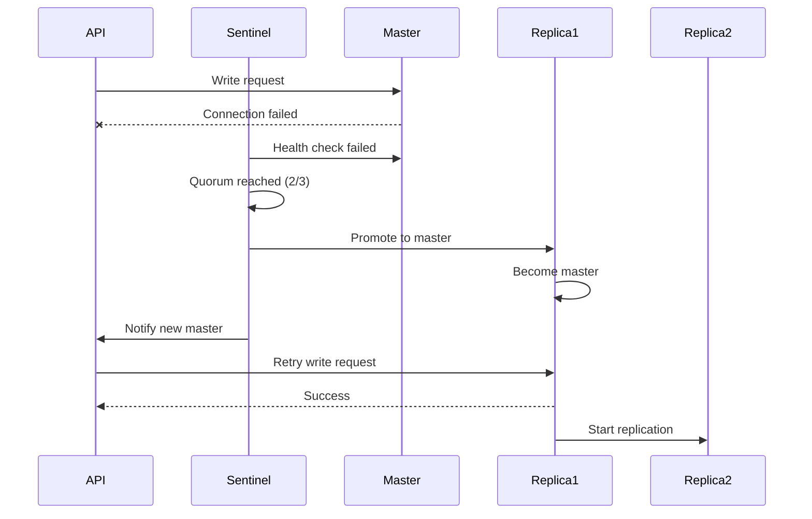
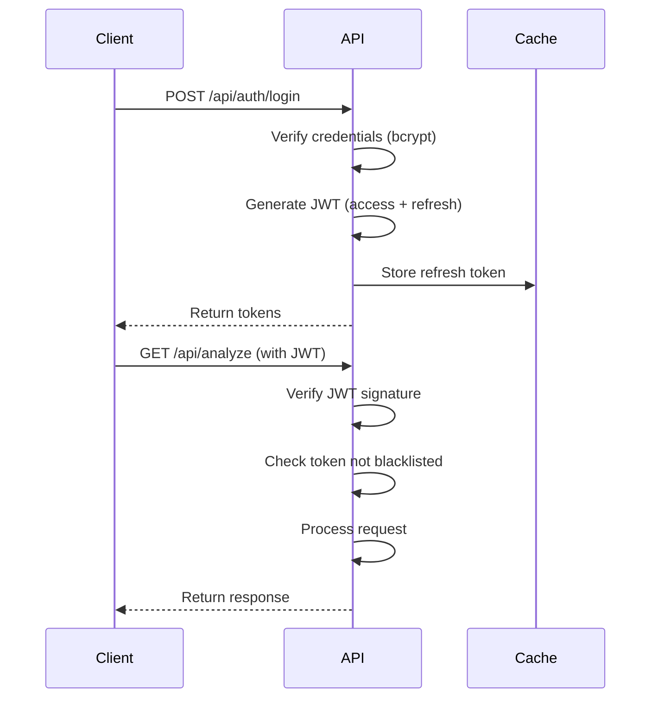

# SentinAL Architecture Documentation

## System Context (C4 Level 1)

### Overview
SentinAL is an AI-powered fraud detection system using Graph Neural Networks (GNN) and GraphRAG for explainable fraud analysis.

### System Context Diagram

### External Dependencies
- **Payment Gateway**: Source of transaction data for fraud analysis
- **Identity Provider**: User authentication and authorization
- **PagerDuty**: Critical incident alerting
- **Slack**: Team notifications and warnings
- **External Monitoring**: Uptime and availability monitoring

---

## Container Diagram (C4 Level 2)

### Container Architecture

### Technology Stack
- **Load Balancer**: NGINX (SSL termination, rate limiting, health checks)
- **API**: FastAPI (Python 3.11+, async/await)
- **Frontend**: React 18 + TypeScript + Vite
- **Cache**: Redis 7 (Sentinel for HA)
- **Metrics**: Prometheus + Grafana
- **Tracing**: OpenTelemetry + Jaeger
- **Alerting**: AlertManager + PagerDuty + Slack

---

## Component Diagram (C4 Level 3)

### API Component Architecture

### Key Components
1. **Authentication**: JWT-based auth with token refresh and blacklisting
2. **Fraud Detection**: R-GCN model for graph-based fraud detection
3. **GraphRAG Explainer**: LangChain + Ollama for explainable AI
4. **Cache Manager**: Redis with automatic fallback to in-memory
5. **Tracing**: OpenTelemetry for distributed tracing
6. **Metrics**: Prometheus instrumentation for monitoring
7. **Logging**: Structured JSON logging with trace correlation

---

## Deployment Diagram

### Production Deployment Architecture

### Infrastructure Requirements
- **Compute**: 3 API instances (2 CPU, 4GB RAM each)
- **Cache**: 1 Redis master + 2 replicas (1 CPU, 2GB RAM each)
- **Monitoring**: Prometheus (2 CPU, 4GB RAM), Grafana (1 CPU, 2GB RAM), Jaeger (2 CPU, 4GB RAM)
- **Load Balancer**: NGINX (1 CPU, 1GB RAM)
- **Total**: ~11 CPU cores, ~25GB RAM

---

## Data Flow Diagrams

### Fraud Detection Request Flow

### Redis Failover Flow

---

## Scalability Patterns

### Horizontal Scaling
- **API Instances**: Scale from 3 to N instances based on load
- **Load Balancing**: Least connections algorithm
- **Session Affinity**: Not required (stateless API)
- **Auto-scaling**: Based on CPU (>70%) or request rate (>1000 req/s)

### Caching Strategy
- **L1 Cache**: In-memory LRU (per instance, 100MB)
- **L2 Cache**: Redis (shared, 256MB)
- **TTL**: 5 minutes for fraud predictions
- **Invalidation**: Manual via API endpoint

### High Availability
- **API**: 3 instances minimum, survives 1 instance failure
- **Redis**: 1 master + 2 replicas, automatic failover via Sentinel
- **Load Balancer**: Active health checks, 30s interval
- **Target SLA**: 99.9% uptime (43 minutes downtime/month)

---

## Security Architecture

### Defense in Depth
1. **Edge**: NGINX rate limiting, SSL/TLS termination
2. **Application**: JWT authentication, input validation
3. **Data**: Redis password auth, encrypted connections
4. **Monitoring**: Security alerts, brute force detection

### Authentication Flow

---

## Monitoring Strategy

### Golden Signals
1. **Latency**: P50, P95, P99 response times
2. **Traffic**: Requests per second
3. **Errors**: Error rate (5xx responses)
4. **Saturation**: CPU, memory, Redis memory

### Alert Severity Levels
- **Critical**: PagerDuty page (API down, all backends down)
- **Warning**: Slack notification (high latency, high error rate)
- **Info**: Slack monitoring channel (low cache hit rate)

### SLOs (Service Level Objectives)
- **Availability**: 99.9% uptime
- **Latency**: P95 < 200ms
- **Error Rate**: < 1%
- **Cache Hit Rate**: > 80%

---

## Technology Decisions

### Why NGINX over Traefik?
- **Maturity**: Battle-tested in production
- **Performance**: Lower latency, higher throughput
- **Features**: Built-in rate limiting, SSL termination
- **Simplicity**: Easier configuration for our use case

### Why Redis Sentinel over Redis Cluster?
- **Simplicity**: Easier to operate and debug
- **Scale**: Sufficient for our current needs (< 1M req/day)
- **Failover**: Automatic with minimal configuration
- **Cost**: Lower resource requirements

### Why Jaeger over Zipkin?
- **Features**: Better UI, more query options
- **Performance**: Better for high-throughput scenarios
- **Ecosystem**: Better OpenTelemetry integration
- **Community**: More active development

---

## Future Enhancements

### Phase 3 (Future)
- **TorchServe**: Separate model serving for better scalability
- **Kubernetes**: Container orchestration for auto-scaling
- **ELK Stack**: Centralized logging with Elasticsearch
- **Multi-region**: Geographic distribution for lower latency
- **A/B Testing**: Model version comparison framework
